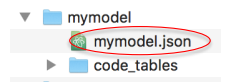

.. cdm documentation master file, created by
   sphinx-quickstart on Fri Apr 16 14:18:24 2021.
   You can adapt this file completely to your liking, but it should at least
   contain the root ``toctree`` directive.

.. _how-to-build-a-data-model:

=========================
How to build a data model
=========================

The main steps to create a data model (or schema) for the mdf_reader are:

1. Create a valid directory tree to hold the model **(mymodel)** as shown in the figure below. The correct directory path to store your schema is ``~/mdf_reader/data_models/library/``.

    Data model directory

2. Create a valid **schema** file under ``mdf_reader/data_models/library/mymodel/mymodel.json``:

To create the schema file, two important aspects of the schema need to be clear beforehand; i) the order and field lengths of each element in the data input string, ii) do the information in the data input needs to be organised into sections, like ICOADS ``.imma`` data format. With this in mind, one can access all the schema file templates available from within the tool via::

   template_names = mdf_reader.schemas.templates()

These templates have been created to ease the generation of new valid schema files, these templates cover from a basic schema format to a more complex one:

- Fixed width or delimited: *fixed_width_* or *delimited_*
- With no sections or with sections: *_basic* or *_sections*
- More complex options include blocks of sections which in the case of ICOADS data are exclusive for certain decks (e.g. deck ``td11``) or blocks of sections that are optional: ``_complex_exc.json`` or ``_complex_opt.json``

To copy a template to edit you can run the following functions::

   mdf_reader.schemas.copy_template(template_name,out_path=file_path)

3. Create valid code tables under ``../library/mymodel/code_tables/table_name[i].json`` if the data model includes code tables.

The general structure of a schema and the description of each attribute is explain in the table below:

+---------------+-----------------+-----------------------------------+
|*Schema block* |*Scope*          |*Attribute*                        |
+---------------+-----------------+-----------------------------------+
|Header         |common           |``encoding``                       |
|               +-----------------+-----------------------------------+
|               |no sections      |``field_layout``, ``delimiter``    |
|               +-----------------+-----------------------------------+
|               |sections         |``parsing_order``                  |
+---------------+-----------------+-----------------------------------+
|Elements       |common           |``column_type``, ``description``,  |
|               |                 |``ignore``, ``missing_value``      |
|               +-----------------+-----------------------------------+
|               |numeric          |``decimal_places``, ``encoding``,  |
|               |                 |                                   |
|               |                 |``offset``, ``scale``,  ``units``  |
|               |                 |                                   |
|               |                 |``valid_max``, ``valid_min``       |
|               +-----------------+-----------------------------------+
|               |object, str      |``disable_white_strip``            |
|               +-----------------+-----------------------------------+
|               |key              |``code_table``,  ``encoding``      |
|               |                 |``disable_white_strip``,           |
|               +-----------------+-----------------------------------+
|               |datetime         |``datetime_format``                |
|               +-----------------+-----------------------------------+
|               |fixed_width      |``field_length``                   |
+---------------+-----------------+-----------------------------------+
|Sections       |common           |``delimiter``, ``disable_read``    |
|(header)       |                 |``field_layout``                   |
|               +-----------------+-----------------------------------+
|               |fixed_width      |``length``, ``sentinal``           |
+---------------+-----------------+-----------------------------------+

.. _schema-header-block:

Schema header block
===================

The **header** block is the first block of the schema file, and is common to all schema types, but some of its descriptors are, however, specific to certain model types.
There is no need to declare a **header** block in data models for which sections are sequential (e.g. all elements in the data source appear in the same order as declared in the sections block).

- Example of a header block for a ``.imma`` based schema::

      "header": {
           "parsing_order": [
               {"s": ["core"]},
               {"o": ["c1","c5","c6","c7","c8","c9","c95","c96","c97","c98"]},
               {"s": ["c99_sentinal", "c99_data", "c99_header", "c99_qc"]}]
       },

+---------------------------+-------------------+
| Scope                     | Descriptor name   |
+===========================+===================+
| Common                    | ``encoding``      |
+---------------------------+-------------------+
| Data models with          | ``parsing_order`` |
| sections (1 or Multiple)  |                   |
+---------------------------+-------------------+
| Data models with no       | ``field_layout``, |
| sections                  | ``delimiter``     |
+---------------------------+-------------------+

- ``delimiter``
      - String type descriptor that defines the field delimiter for data models.
      - Setting this descriptor makes the default value of ``field_layout`` == ``delimited``
      - Mainly this descriptor will be use if ``field_layout`` == ``delimited``
      - When use together with ``field_layout`` == ``fixed_width`` the code understands that the data layout is a mixture of *delimited* and *fixed_width* strings. In this case the delimiter is removed and the section is read as a ``fixed_width`` type of section.
      - This case has been added to overcome how pandas managed the ``c99`` section in ``.imma1`` model. e.g. Deck 704 c99 section, which is a sequence of fixed width elements separated by commas.
      - Applies to ``delimited`` and ``fixed_width`` field layouts
      - It is a mandatory field only in the case that ``field_layout`` == ``delimited``

- ``encoding``
      - String type descriptor that denotes the file encoding
      - Applies to all elements
      - It is not a mandatory field descriptor
      - Options:
         1. all python supported, see the following `link <https://docs.python.org/3.7/library/codecs.html#standard-encodings>`_ for all possible encodings.
         2. defaults to `utf-8`

- ``filed_layout``
      - String type descriptor that defines the layout of fields in the data model with no sections
      - Applies to all data models with no sections
      - Is mandatory descriptor (for data models with no sections)
      - Options:
         1. ``delimited`` or ``fix_width``
         2. Defaults to ``delimited`` if ``delimiter`` is set, but can be specified to ``fixed_width`` type together with a ``delimiter`` option.

- ``parsing_order``
      - List of dictionaries containing the order in which the tool must look for sections in a report and grouped the data by section block types. This field applies to those data types which reports are divided into multiple sections i.e. ICOADS data
      - Applies to all data models with multiple sections
      - The different section block types are:

         1. ``s``: *sequential*. Sections in this block appear as listed in all reports.
         2. ``e``: *exclusive*. Among the sections listed in the block, only one of them appears in every report.
         3. ``o``: *optional*. Any combination of sections listed in the block can be present in the report. Any order, any missing or present (but does not handle repetitions).

      - Example::

         ``parsing_order``: [{"s":["core"]}, {"o":["c1", "c99"]}]

.. _schema-element-block:

Schema element block
====================
The elements block is a feature common to all data model types. It is the second and last block of data in a schema file with no sections, while it is part of each of the sections' blocks in more complex schemas. This is an example of an element block::

         "elements": {
                      "YR": {
                          "description": "year UTC",
                          "field_length": 4,
                          "column_type": "uint16",
                          "valid_max": 2024,
                          "valid_min": 1600,
                          "units": "year"
                      },
                      "MO": {
                          "description": "month UTC",
                          "field_length": 2,
                          "column_type": "uint8",
                          "valid_max": 12,
                          "valid_min": 1,
                          "units": "month"
                      },
                      "DY": {
                          "description": "day UTC",
                          "field_length": 2,
                          "column_type": "uint8",
                          "valid_max": 31,
                          "valid_min": 1,
                          "units": "day"
                      },
                      "HR": {
                          "description": "hour UTC",
                          "field_length": 4,
                          "column_type": "float32",
                          "valid_max": 23.99,
                          "valid_min": 0.0,
                          "scale": 0.01,
                          "decimal_places": 2,
                          "units": "hour"
                      }}

Elements in the data are parsed in the order they are declare here. The element block above would define a file / section with elements named: ``YR``, ``MO``, ``DY`` and ``HR``.
All elements attributes, some of which are data type specific, are listed and detailed in the following table:

+---------------------------+----------------------------------------------------------------+
| Scope                     | Descriptor name                                                |
+===========================+================================================================+
| Common                    | ``column_type``, ``description``, ``ignore``, ``missing_value``|
+---------------------------+----------------------------------------------------------------+
| Fixed width types         | ``field_length``                                               |
+---------------------------+----------------------------------------------------------------+
| Numeric types             | ``decimal_places``, ``encoding``, ``offset``, ``scale``,       |
|                           | ``valid_max``, ``valid_min``                                   |
+---------------------------+----------------------------------------------------------------+
| Object, ``str`` types     | ``disable_white_strip``                                        |
+---------------------------+----------------------------------------------------------------+
| Key type                  | ``codetable``, ``disable_white_strip``, ``encoding``           |
+---------------------------+----------------------------------------------------------------+
| Datetime type             | ``datetime_format``                                            |
+---------------------------+----------------------------------------------------------------+

- ``description``
      - String type descriptor that describes the data element (e.g. free text describing the data element).
      - Applies to all elements

- ``field_length``
      - Numeric integer descriptor that determines the field length of the elements (number of bytes or number of characters in a report string).
      - Applies to the schema format type: ``fixed_width`` and is a mandatory field in the element block.
      - It can be set to `null`, or not present; if the element is unique in a section whose length is unknown and if this section is the last in the data model (e.g. like it is usually the case for ICOADS supplemental data section c99). If this is the case and the length is unknown the default will be set by the function `mdf_reader.properties.MAX_FULL_REPORT_WIDTH() <https://mdf-reader.readthedocs.io/en/mdf_reader/autoapi/mdf_reader/properties/index.html#module-mdf_reader.properties>`_, which sets the ``field_length`` to 100000.

- ``column_type``
      - Numeric integer descriptor that determines the element data type.
      - Mandatory field.
      - Applies to all elements
      - Options:
         1. Numeric data types: all types interpreter by `numpy <https://numpy.org/devdocs/user/basics.types.html>`_.
         2. Datetimes: string or ``datetime64[ns]`` object that formats dates or datetimes when read in a single field. The object must be a `datetime.datetime <https://docs.python.org/3/library/datetime.html#module-datetime>`_ valid format. Can be also read via code tables and the parameter ``key``.

- ``missing_value``
      - String type descriptor that denotes if there are additional missing values to tag for an element in a schema.
      - Applies to all elements
      - Default values are the same as `pandas default missing values <https://pandas.pydata.org/pandas-docs/stable/user_guide/missing_data.html#working-with-missing-data>`_

- ``ignore``
      - Boolean type descriptor that ignores an element on the output
      - Options: ``True`` or ``False``, defaults to ``False``
      - Applies to all elements
      - Is not a mandatory field descriptor

- ``units``
      - String type descriptor that states the units of the measured data element.
      - Applies to *column_type. [numerics]* elements.
      - Is not a mandatory field descriptor
      - Defaults to ``None``

- ``encoding``
      - String type descriptor added if an element needs it
      - Is not a mandatory field
      - Not to be confuse with file ``encoding``
      - Applies to *column_type. [numerics]* elements and *column_type. [key]* elements
      - Defaults to ``None``
      - Options:
            1. ``base36``
            2. ``signed_overpunch``

- ``valid_max``
      - Numeric type of descriptor that indicates the valid maximum value for numeric elements. This should be the valid maximum in variable declared units, after decoding and conversion (offset, scale...) and it is use for element validation.
      - Applies to *column_type. [numerics]* elements
      - Is not a mandatory field
      - Defaults to *+inf*

- ``valid_min``
      - Numeric type of descriptor that indicates the minimum value for numeric elements. This should be the valid minimum in variable declared units, after encoding and conversion (offset, scale ...) and it is use for element validation.
      - Applies to *column_type. [numerics]* elements
      - Is not a mandatory field
      - Defaults to *-inf*

- ``scale``
      - Numeric type of descriptor. This scale is applied to numeric elements in order to convert the original value to the declared element units.
      - Applies to *column_type. [numerics]* elements
      - Is not a mandatory field
      - Defaults to *1*

- ``offset``
      - Numeric type of descriptor. This offset is applied to numeric elements in order to convert the original value to the declared element units.
      - Applies to *column_type. [numerics]* elements
      - Is not a mandatory field
      - Defaults to *0*

- ``decimal_places``
      - Numeric integer descriptor that defines the number of decimal places to which the observed value is reported.
      - Applies to *column_type. [numeric_floats]* elements
      - Is not a mandatory field
      - Defaults to ``pandas.display.precision`` = 6.

- ``codetable``
      - String type of descriptor containing the key code look up table name. It is the File basename of a code table (with no .json extension) located in the ``mymodel/code_tables`` directory. See :ref:`code-tables` for more information.
      - Applies to *column_type. [key]* elements
      - Is mandatory if ``"column_type": "key"``.

- ``disable_white_strip``
      - Boolean or string type descriptor that modifies the default leading/trailing blank stripping.
      - Applies to *column_type. [key, object, str]* elements
      - Options:
            1. *do not perform any stripping: true*
            2. *do not perform right stripping (trailing blanks): `r`*
            3. *do not perform left stripping (leading blanks): `l`*
      - Is not a mandatory field
      - Defaults to *false*

- ``datetime_format``
      - String type of descriptor that sets the format for the dates.
      - Applies to *column_type. [datetime]* elements
      - Is not a mandatory field
      - Defaults to ``%Y%m%d``
      - All python.datetime formats are valid.

Schema section block
====================

If the data model is organized in sections then the schema has two main blocks: **the header** (see :ref:`schema-header-block`) and **the sections blocks**. The sections block has a separate block per section, with the following general layout:

   - A section specific header (or sub-header) with info on how to access that specific section.
   - The section's elements block (See :ref:`schema-element-block`)

Example of a schema section block: "core" section of the ``.imma`` schema::

      "sections": {
           "core": {
               "header": {"sentinal": null,"length": 108},
               "elements": {
                   "YR": {
                       "description": "year UTC",
                       "field_length": 4,
                       "column_type": "uint16",
                       "valid_max": 2024,
                       "valid_min": 1600,
                       "units": "year"
                   },
                   "MO": {
                       "description": "month UTC",
                       "field_length": 2,
                       "column_type": "uint8",
                       "valid_max": 12,
                       "valid_min": 1,
                       "units": "month"
                   }
              }
          }
      }

Section header
--------------

- ``delimiter``
      - String type descriptor that defines the field delimiter for the data model section.
      - Setting this descriptor makes the default value of ``field_layout`` == ``delimited``
      - Mainly this descriptor will be use if ``field_layout`` == ``delimited``
      - When use together with ``field_layout`` == ``fixed_width`` the code understands that the data layout is a mixture of *delimited* and *fixed_width* strings. In this case the delimiter is removed and the section is read as a ``fixed_width`` type of section.
      - Applies to ``delimited`` and ``fixed_width`` field layouts
      - It is a mandatory field only in the case that ``field_layout`` == ``delimited``

- ``disable_read``
      - Boolean type descriptor that if set to True will ignore the elements of that section. This section will then be produced in the output as a single string.
      - Options: ``True`` of ``False``
      - Defaults to False

- ``field_layout``
      - String type descriptor that defines the layout of fields in the section of the data model
      - Applies to all sections
      - If field ``delimiter`` is set, then ``field_layout`` defaults to ``delimited``, else to ``fixed_width``.
      - This descriptor does not need to be specified in the schema files in the majority of the cases. However, to account for mixed formats, like c99 section in imma1 files for deck 704, this default setting can be overridden by specifying the ``field_layout`` parameter.
      - Options:
         1. ``delimited`` or ``fix_width``
         2. Defaults to ``delimited`` if ``delimiter`` is set, else defaults to what ever is set in the ``fixed_width``.

- ``sentinal``
      - String type of descriptor that allows the code to identify a section.
      - Applies to sections of *format.fixed_width*
      - It is a mandatory field if the section is unique, unique in a parsing_order block, or part of a sequential parsing_order block.
      - Elements bearing the sentinal need to be, additionally, declared in the elements block.

- ``length``
      - Numeric integer type of descriptor that defines the length of the section (how many bytes or characters in a string).
      - Applies to *format.fixed_width*
      - It is a mandatory field
      - Can be also set to ``null``, or not reported, if the section is the last one to be parsed and the length is unknown (like the c99 section of the `.imma` model.

Section elements
----------------

Same as :ref:`schema-element-block`.

Code Tables
===========

To learn about how to construct a code table, please read the :ref:`code-tables` section.
