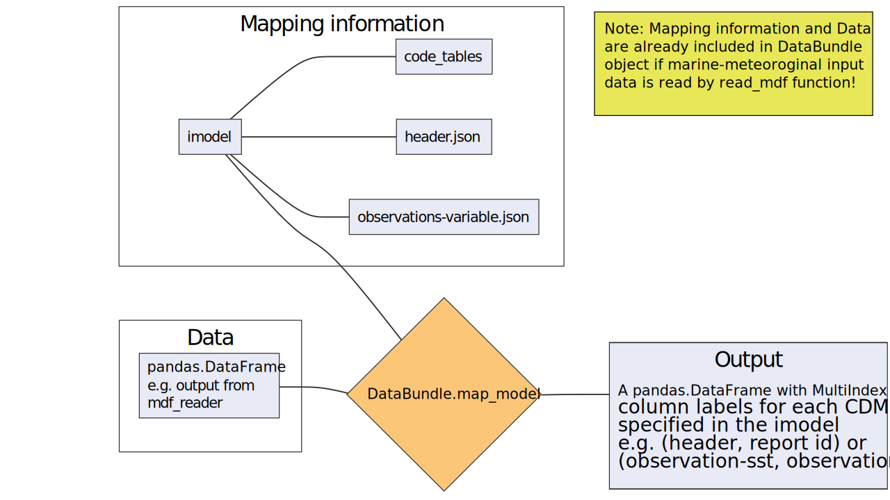

.. _tool-overview-mapper:

Overview of the mapping to the Common Data Model (CDM_)
=======================================================

After reading ICOADS or C-RAID data with the :py:func:`cdm_reader_mapper.read_mdf` function, this data can be mapped to the standardized C3S Common Data Model (CDM_) format.

Workflow
--------

    Simplified workflow how to map data to the CDM

.. code-block:: console

   from cdm_reader_mapper import read_mdf
   from cdm_reader_mapper.test_data import test_icoads_r300_d704 as test_data

   filepath = test_data.source
   imodel = "icoads_r300_d704"

   db = read_mdf(filepath, imodel=imodel)

   db_cdm = db.map_model()

   cdm_tables = db_cdm.data

.. note:: Set ``inplace`` to True to overwrite :py:attr:`DataBundle.data`:

.. code-block:: console

   db.map_model(inplace=True)

   cdm_tables = db.data

Instead of using :py:class:`cdm_reader_mapper.DataBundle`'s method function to map data, it can be mapped directly from a :py:class:`pandas.DataFrame` using :py:func:`cdm_reader_mapper.map_model`.

.. code-block:: console

   from cdm_reader_mapper import map_model

   imodel = db.imodel
   data = db.data

   tables = map_model(data=data, imodel=imodel)

Input data
----------

An ``imodel`` consist of a collection of `.json` files (or :py:class:`dict`) and python functions (``imodel.py``) that specify how a given :py:class:`pandas.DataFrame` containing marine meteorological data, should be organise and map to the CDM_ format.

The CDM_ format splits meteorological reports into **header** and **observational records**, separating the data into different tables/files and column order. An ``imodel`` therefore consist of the following files:

1. ``header.json``: maps variables in the data that can provide information about the source of each meteorological report (e.g. profile configuration, station configuration and source configuration)

2. ``observations-variable.json``: this contains the mapping information for the observed variable and also important metadata information, like original value, original units. (e.g. ``observations-at.json`` will contain specific information about the sensor used to measure the air temperature, units, sensor height, etc)

3. ``imodel.py``: is a python script containing a full set of transforming functions. Each function has a specific role, to transform a variable or a parameter into a format compatible with the CDM format (e.g. all temperatures in the CDM format should be given in Kelvin as stated in the CDM_).

The data to map must have the following structure:

1.	``data``: Be a :py:class:`pandas.DataFrame` with the data values organised into sections and/or columns.
2.	``imodel``: Name of the input data model, e.g. ``icoads_r300_d714``.

Output data
-----------

The output of the main mapper function is a :py:class:`pandas.DataFrame` with :py:class:`pandas.MultiIndex` column labels (``(cdm_table_name), (cdm_table)``, that can be afterwards printed to a pipe-seperated list file. Each file or python dictionary contains one of the CDM tables for which a mapping has been defined in the ``imodel``. Optionally, the intermediate mapped python object can also be accessed.

With the above settings this tool supports mapping to the CDM format by:

   - Direct mapping from an ``imodel`` element
   - Assignment of a default value
   - ``imodel`` elements transformation including any combination of the following: element combination, simple parameterization (input keyword arguments) or``imodel`` elements attributes.
   - ``imodel`` or **CDM** coded values:

         - From ``imodel`` key to **CDM** key
         - From ``imodel`` key to **CDM** value: done by transforming functions in ``imodel.py``
         - From ``imodel`` value to **CDM** key: also done by transforming functions in ``imodel.py``

You can write the CDM tables to disk using method function :py:func:`cdm_reader_mapper.DataBundle.write`:

.. code-block:: console

   db.write(mode="tables")

There are two options to read those data again:

.. code-block:: console

   db = read_tables(data="data.csv")

or

.. code-block:: console

   db = read(data="data.csv", tables="data")

.. include:: hyperlinks.rst
