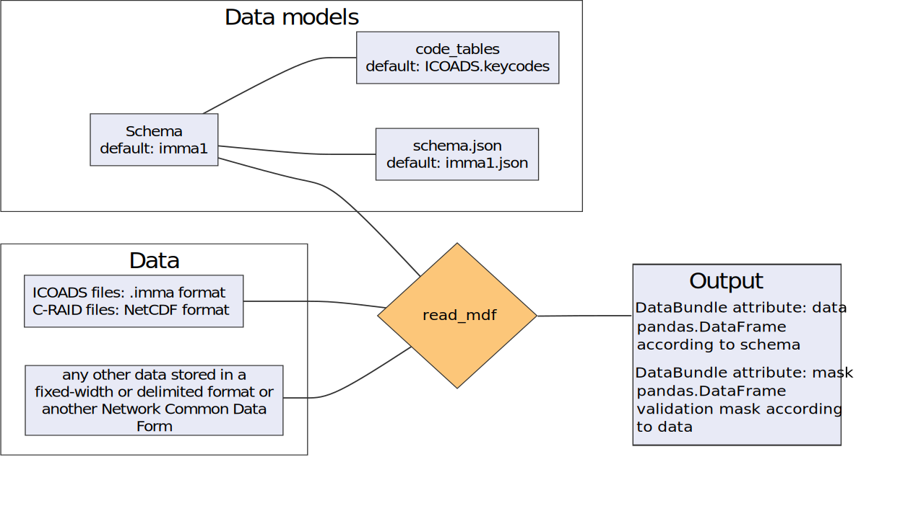

.. cdm documentation master file, created by
   sphinx-quickstart on Fri Apr 16 14:18:24 2021.
   You can adapt this file completely to your liking, but it should at least
   contain the root ``toctree`` directive.

Tool overview
=============

In the tool's context, a data model is the combination of a **schema file** with information on the file format and its contents and, optionally, the data model contains a set of code tables with ``key:value`` pairs, to translate encoded information in some data elements:

   e.g. Temperature units might be store as numeric values 1 or 2 and this translates to ``1:Celsius`` and ``2:Fahrenheit``.

Workflow
--------

    Simplified workflow of the main function in the tool

Input data: ``.imma`` files and schemas
---------------------------------------

The tool has been created to read meteorological data from ICOADS_3_ stored in the ``.imma`` format, please read the `following guide`_ to know more details regarding the database and the data format.

Each meteorological report in ICOADS can come from multiple countries, sources and platforms and each report has a source ID (SID) and a deck (DCK) number assigned. “Deck” was originally referred to a punched card deck, but is now used as the primary field to track ICOADS data **collections**. Each deck may contain a single Source ID (SID) or a mixture of SIDs.

The data stored in the ``.imma`` format is stored as a fixed width and/or a field delimited file. The **mdf_reader** reads the data, organise it into sections and validates them against a declared data model (also referred here as **schema**) which can be source ID and deck dependent.

The **core** meteorological variables stored in the ``.imma`` format can be read by using the general ``imma1`` schema included in this tool.

**Supplemental metadata attachments** require a specific **schema** customized to read supplemental metadata from a specific source and deck ("collection"). Several **schemas** are already included in this tool in order to read 18th century ship meteorological metadata.

All schemas are located under the following directory: ``mdf_reader/data_models/library/``

.. note:: For each SID-DCK number the data model or schema use to read supplemental metadata will different. e.g. to read metadata from the `US Maury`_ Ship data collection SID 69 and DCK 701, we will use the schema ``imma_d701``)

Output:
-------

The output of the **mdf_reader** is a python object with three attributes:

• **data**: python pandas.DataFrame_ with data values.
• **atts**: `python dictionary`_ with attributes of each of the output elements inherited from the input data model **schema**.
• **mask**: boolean DF with the results of the validation of each of the data model elements in its columns.

Processing of the data elements
-------------------------------

The individual data element definitions in the schema determines how each element is extracted, transformed and validated within the tool. If the data model or schema has its data elements organised in sections, the reader first identifies the string chunks corresponding to the different sections.

If the data model has no sections, the reader works with the full report as a single chunk.

Afterwards, data elements are extracted from each of these chunks, as shown in the figure below, where each element in the input dataframe is linked to its attributes (orange text) defined within the data model/schema (e.g. elements encoding type, bytes length, etc).

.. figure:: _static/images/fig1.png
    :width: 100%

    Schematic representation of the integral process of reading, transforming and validating a data element.

Data elements extraction and transformation
-------------------------------------------

The data element extraction and transformation from the initial string to the output dataframe occurs mainly in 3 steps:

1. **Elements extraction and missing data tagging**:

   Done using ``mdf_reader.import_data.import_data``, where individual data elements are extracted as 'objects' from the full report string and missing data is recognised as ``NA/NaN`` values in the resulting dataframe.

   Strings that are recognised as missing from the source are ``pandas`` defaults, plus:

      * Those defined in the data model's/schema as NaN by making use of the ``missing_value`` attribute.
      * Those defined as blanks if ``disable_white_strip`` is set to not ``True``

2. **Unpacking of encoded elements**:

   Data elements with encoding defined in the schema element attributes are decoded and casted to their declared ``column_type`` [#f1]_. Elements where the decoding fails or is not recognised by the tool, are marked as ``NA/NaN`` values in the resulting dataframe.

3.	**Element conversion**:

   Data elements are converted (and optionally transformed) to their final data types (and units) if specified in the data model/schema.

   *Numeric* type elements:
      *	Safe conversion to numeric; ``NaN`` where conversion is not possible.
      *	There is the option of applying to each element a *scale* and an *offset*: ``offset + scale*i``
      *	Safe conversion of ``column_type``

   *object*, *string* and *key* type elements:
      Leading and trailing whitespace stripping unless otherwise declared in ``disable_white_strip`` (disable all, leading or trailing blank stripping).

   *datetime* type elements:
      Safe parsing to datetime objects with pandas.to_datetime_, assigning `NaT` where the conversion is not possible.

Validation of elements against the schema or data model
-------------------------------------------------------

Data model validation is initiated after each element unpacking and conversion. New ``Na/NaN`` values in the data (not identified as missing values during extraction) are understood by the tool to have fail unpacking or conversion, and thus, are not validate against the data model. The resulting preliminary validation mask values are:

   *	``False``: invalid decoding, conversion
   *	``True``: missing data, rest

Once elements are in the final form, *numeric* and *key* elements are validated against their corresponding attributes in the schema (``valid_max|valid_min`` and ``codetable``, respectively), with the final values in the validation mask being:

   *	``False``: invalid decoding, conversion, data model values
   *	``True``: missing data, rest

Overall, the validation process exception handling is:

   *	Missing values: ``True``
   *	Numeric type elements where either upper|lower bound is missing: ``False``
   *	key type elements where no codetable is found (or defined in the data model): ``False``
   *	Rest: ``True``

.. rubric:: Footnotes
.. [#f1] If ``NaN`` values are present, and column_type is integer, conversion to column_type will not be possible and data type will be as pandas casting rules (`Missing data casting rules and indexing`_).

.. include:: hyperlinks.rst
