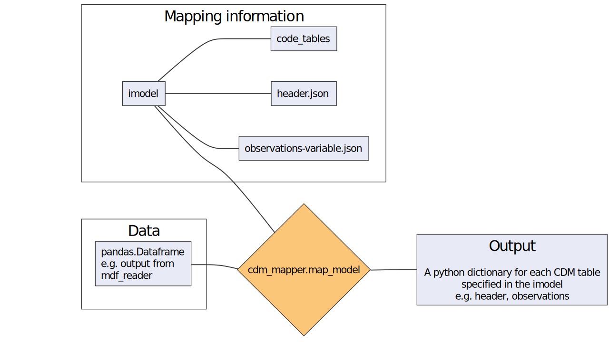

``cdm_mapper`` overview
=======================

After reading ICOADS or C-RAID data with the ``mdf_reader``, this data can be mapped to the standardized C3S Common Data Model (CDM) format.

Workflow
--------

    Simplified workflow of the ``cdm_mapper``

Input data
----------

An ``imodel`` consist of a collection of `.json` files (or `python dictionaries <https://realpython.com/python-dicts/>`_) and python functions (``imodel.py``) that specify how a given `pandas.DataFrame <https://pandas.pydata.org/pandas-docs/stable/reference/api/pandas.DataFrame.html>`_ containing marine meteorological data, should be organise and map to the `CDM <https://git.noc.ac.uk/brecinosrivas/cdm-mapper/-/blob/master/docs/cdm_latest.pdf>`_ format.

The `CDM <https://git.noc.ac.uk/brecinosrivas/cdm-mapper/-/blob/master/docs/cdm_latest.pdf>`_ format splits meteorological reports into **header** and **observational records**, separating the data into different tables/files and column order. An ``imodel`` therefore consist of the following files:

1. ``header.json``: maps variables in the data that can provide information about the source of each meteorological report (e.g. profile configuration, station configuration and source configuration)

2. ``observations-variable.json``: this contains the mapping information for the observed variable and also important metadata information, like original value, original units. (e.g. ``observations-at.json`` will contain specific information about the sensor used to measure the air temperature, units, sensor height, etc)

3. ``imodel.py``: is a python script containing a full set of transforming functions. Each function has a specific role, to transform a variable or a parameter into a format compatible with the CDM format (e.g. all temperatures in the CDM format should be given in Kelvin as stated in the `CDM manual <https://git.noc.ac.uk/brecinosrivas/cdm-mapper/-/blob/master/docs/cdm_latest.pdf>`_).

The data to map must have the following structure:

1.	Be a `pandas.DataFrame <https://pandas.pydata.org/pandas-docs/stable/reference/api/pandas.DataFrame.html>`_ (DF) with the data values organised into sections and/or columns.
2.	Attributes stored in the ``pandas.Dataframe`` as a python `dictionary <https://realpython.com/python-dicts/>`_ describing a simplified version of the input data model or schema.

.. note:: The ``cdm_mapper`` relies on the output of the ``mdf_reader``.

Output data
-----------

The output of the main mapper function is a python `dictionary <https://realpython.com/python-dicts/>`_ with the ``{cdm_table_name : cdm_table_object}`` pairs of data, that can be afterwards printed to an ascii file. Each file or python dictionary contains one of the CDM tables for which a mapping has been defined in the ``imodel``. Optionally, the intermediate mapped python object can also be accessed.

With the above settings this tool supports mapping to the CDM format by:

   - Direct mapping from an ``imodel`` element
   - Direct assignment from the ``imodel`` elements attributes
   - Assignment of a default value
   - ``imodel`` elements transformation including any combination of the following: element combination, simple parameterization (input keyword arguments) or``imodel`` elements attributes.
   - ``imodel`` or **CDM** coded values:

         - From ``imodel`` key to **CDM** key
         - From ``imodel`` key to **CDM** value: done by transforming functions in ``imodel.py``
         - From ``imodel`` value to **CDM** key: also done by transforming functions in ``imodel.py``
